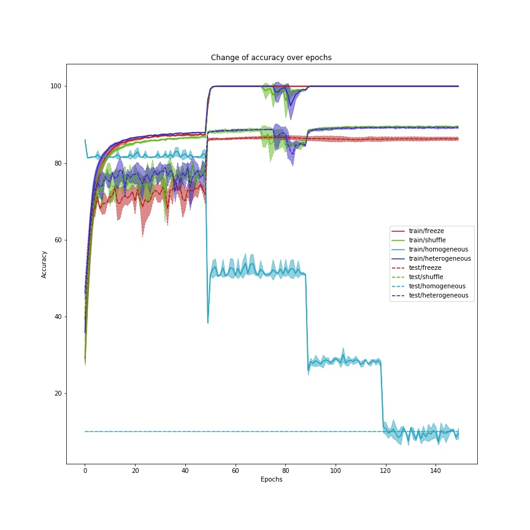

# Machine Intelligence with Deep Learning
## Importance batching for improved training of neural networks
---
**Course description**: Current day neural networks are trained using stochastic learning, which consists of splitting the (usually large) training data into multiple batches, called mini-batches. This is desirable since it speeds up training and helps the network's convergence due to the added noise. However, the samples that form such mini-batches are usually chosen randomly throughout training, which might not be ideal for optimal learning. The goal of this topic is to study the effects of constructing each mini-batch using importance sampling techniques based on the network's loss.

--- 
This repository holds the code for the **MIDL** seminar by [**Hasso-Plattner-Institut**](https://hpi.de).  
In this seminar, we're trying to find out whether there are better approaches for creating mini batches than random-sampling. Current ideas are:
- Sorting batches by overall loss 
- Sorting batches by loss per category
- Sorting by class distribution
- Batching dynamic sizes
- ...

---

