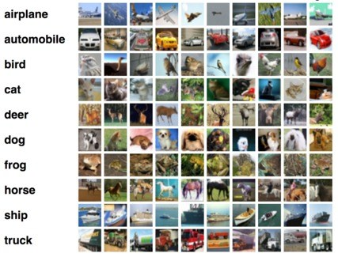

# Machine Intelligence with Deep Learning
## Importance batching for improved training of neural networks
---
**Course description**: Current day neural networks are trained using stochastic learning, which consists of splitting the (usually large) training data into multiple batches, called mini-batches. This is desirable since it speeds up training and helps the network's convergence due to the added noise. However, the samples that form such mini-batches are usually chosen randomly throughout training, which might not be ideal for optimal learning. The goal of this topic is to study the effects of constructing each mini-batch using importance sampling techniques based on the network's loss.

--- 
This repository holds the code for the **MIDL** seminar by [**Hasso-Plattner-Institut**](https://hpi.de).  
In this seminar, we're trying to find out whether there are better approaches for creating mini batches than random-sampling. Current ideas are:
- Sorting batches by overall loss 
- Sorting batches by loss per category
- Sorting by class distribution
- Batching dynamic sizes
- ...

---
**Model**: ResNet

**Dataset**: [CIFAR-10](https://www.cs.toronto.edu/~kriz/cifar.html)
The CIFAR-10 dataset consists of 60000 32x32 colour images in 10 classes, with 6000 images per class. There are 50000 training images and 10000 test images.
The dataset is divided into five training batches and one test batch, each with 10000 images. The test batch contains exactly 1000 randomly-selected images from each class. The training batches contain the remaining images in random order, but some training batches may contain more images from one class than another. Between them, the training batches contain exactly 5000 images from each class.

**Legend**: TODO

**Metrics**: The following table shows the _best_ metrics which the model reached in the given mode after 150 epochs.

| Mode          | Training | Accuracy | Loss  |
|---------------|----------|----------|-------|
|Freeze         | X        |100.00    |0.030  |
|Shuffle        | X        |100.00    |0.030  |
|Homogeneous    | X        |085.95    |0.045  |
|Heterogeneous  | X        |100.00    |0.028  |
|Freeze         |          |086.65    |0.026  |
|Shuffle        |          |089.57    |0.026  |
|Homogeneous    |          |010.00    |0.209  |
|Heterogeneous  |          |089.26    |0.024  |

**Graphs**: The complete results can be analyzed given the following two graphs.

